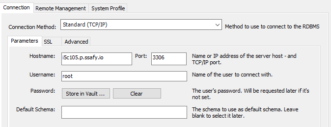

### JVM
```
openjdk version "1.8.0_292"  
OpenJDK Runtime Environment (build 1.8.0_292-8u292-b10-0ubuntu1~20.04-b10)  
OpenJDK 64-Bit Server VM (build 25.292-b10, mixed mode)
```

### 웹서버
nginx 1.18.1  
<details><summary>nginx 설정파일</summary>
/etc/nginx/sites-available/default  

```
##
# You should look at the following URL's in order to grasp a solid understanding
# of Nginx configuration files in order to fully unleash the power of Nginx.
# https://www.nginx.com/resources/wiki/start/
# https://www.nginx.com/resources/wiki/start/topics/tutorials/config_pitfalls/
# https://wiki.debian.org/Nginx/DirectoryStructure
#
# In most cases, administrators will remove this file from sites-enabled/ and
# leave it as reference inside of sites-available where it will continue to be
# updated by the nginx packaging team.
#
# This file will automatically load configuration files provided by other
# applications, such as Drupal or Wordpress. These applications will be made
# available underneath a path with that package name, such as /drupal8.
#
# Please see /usr/share/doc/nginx-doc/examples/ for more detailed examples.
##

# Default server configuration
#
server {
	listen 80 default_server;
	listen [::]:80 default_server;

	# SSL configuration
	#
	# listen 443 ssl default_server;
	# listen [::]:443 ssl default_server;
	#
	# Note: You should disable gzip for SSL traffic.
	# See: https://bugs.debian.org/773332
	#
	# Read up on ssl_ciphers to ensure a secure configuration.
	# See: https://bugs.debian.org/765782
	#
	# Self signed certs generated by the ssl-cert package
	# Don't use them in a production server!
	#
	# include snippets/snakeoil.conf;

	#root /var/www/html
	root /home/ubuntu/S05P13C105/frontbase/dist;


	# Add index.php to the list if you are using PHP
	index index.html index.htm index.nginx-debian.html;

	server_name _;

	location / {
		# First attempt to serve request as file, then
		# as directory, then fall back to displaying a 404.
		try_files $uri $uri/ =404 /index.html;
	}

	

	##### 여기부터 백엔드 리버스 프록시로 설정 추가
	location /api {
		proxy_pass http://localhost:8080;
		proxy_http_version 1.1;
		proxy_set_header Upgrade $http_upgrade;
		proxy_set_header Connection "upgrade";
		proxy_set_header Host $host;
		proxy_set_header X-Real-IP $remote_addr;
		proxy_set_header X-Forwarded-For $pr:39.oxy_add_x_forwarded_for;
		proxy_set_header X-Forwarded-Proto $scheme;
		proxy_set_header X-Forwarded-Host $host;
		proxy_set_header X-Forwarded-Port $server_port;
	}
	###### 여기까지
}

```
</details>

### 데이터베이스 접속정보
password : 1234  
  

application.properties
```
spring.datasource.driver-class-name=com.mysql.cj.jdbc.Driver
spring.datasource.url=jdbc:mysql://localhost:3306/mydb?serverTimezone=Asia/Seoul&characterEncoding=UTF-8
spring.datasource.username=root
spring.datasource.password=1234
```
